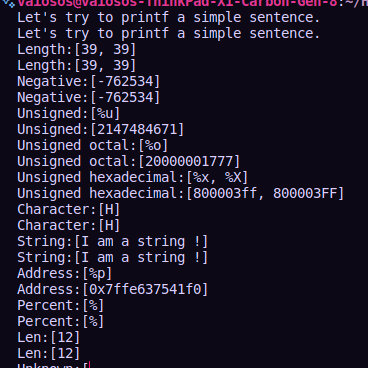

# _printf();

### Description

------------

 The _printf() function is a custom implementation of the printf function in the C standard library. The _printf() function produces output according to a format as described below. The _printf() function writes output to stdout, the standard output stream; it writes the output under the control of a format string that specifies how subsequent arguments (or arguments accessed via the variable-length argument facilities of stdarg) are converted for output.
_printf() function format string is a character string, beginning and ending in its initial shift state, if any.
These arguments are placed using the percentage '%' operator

------------

#### Compilation

------------

The code must be compiled this way:

**$ gcc -Wall -Werror -Wextra -pedantic *.c -o printf**

As a consequence, be careful not to push any c file containing a main function in the root directory of your project (you could have a test folder containing all your tests files including main functions)

The main files will include your main header file (holberton.h): **#include holberton.h**

------------

#### Use & Examples

------------

**Prototype:** int _printf(const char *format, ...);
**Use - General:** _printf("format string", var1, var2, ...);

**Examples:**
 - Basic String: _printf("%s Holberton", "Hello");`
	 - Output: Hello Holberton

- Print integers: _printf("This is an array element: arr[%d]:%c", 32, arr[32]);`
	- Output: This is an array element arr[32]:A

Many other specifiers and flags were added and by combinig those the _printf() function generate a different ouput. The following list are the specifiers and flags allowed.

------------

###### Specifiers

Specifier                |Output                        |Examples |
|----------------|-------------------------------|-----------------------------|
| `c` | Character | y |
| `d` or `i` | Signed integer | 1024, -1024 |
| `s` | String of characters | Hello Holberton |
| '%' | Prints Mod | %% |

------------

|Name                |Information                        |Relevant Files                         |
|----------------|-------------------------------|-----------------------------|
|`manprintf.1` |Man page of the _printf() function.| `None` |
|`main.h`| Header file with the data type struct, standard libraries and custom prototypes.| `*.c compilation` |
\`_printf.c`|Main printf function file. Calls other functions.|`printf_(name of var).c file` |
\`_putchar.c` |Custom putchar function. | `None` |
\`functions.c` |Define functions. | `main.h` |
\`get_function.c` | Function handler. | `_printf.c main.h` |

------------

###### Authors

Alexander G. Puga Melendez

Hey there! Im `Jesus R. Mendez Cruz` you can find me over at:  [GitHub](https://github.com/JRMC-PR) / [linkedin](https://www.linkedin.com/in/jes%C3%BAs-m%C3%A9ndez-068b8a27a/). Im a recenly graduated software engineer from Holberton School. I have a passion for learning and teaching others. I love to code and I am always looking for new challenges and opportunities to grow as a professional.

